# Functional User Flows

This document explains the main user-facing flows in plain language.

It focuses on how the system behaves for users rather than on implementation details.

## The Big Picture

The app organizes information in layers.

- a person can have one or more subjects
- a subject can have one or more episodes
- an episode can have one or more tracks
- a track can have one or more segments

You can think of it like this:

- the subject is the main record
- the episode is a specific case or event inside that record
- the track is a line of observation inside the episode
- the segment is a smaller time slice or detail inside the track

Related screenshots:

- 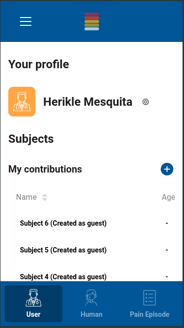
- 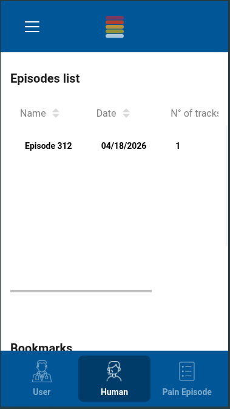

## Login Flow

When a registered user logs in, the system checks their credentials and gives them access to their saved data.

If the user was previously working as a guest, the login process can also connect that guest work to the user account. In that case, the guest episode is moved under the logged-in user so it becomes part of their saved history.

In practice, login can do two things at once:

1. sign the user in
2. attach unfinished guest work to that user

Fallback login credentials are not documented in this repository.

## Episode Creation Flow

### Logged-in user path

When a logged-in user creates a new episode, the system immediately prepares it for editing.

It creates:

1. the episode
2. the first track inside that episode
3. the first 3 empty segments inside that track

If the user already chose which subject the episode belongs to, the episode is saved under that subject.

If the user did not choose a subject, the system creates one automatically so the episode is still stored in an organized way.

### Guest user path

When a guest creates an episode, the system also creates:

1. one episode
2. one initial track
3. three empty segments

The difference is ownership. Guest work is saved, but it is not yet attached to a real account until the user later logs in or signs up.

Related screenshots:

- 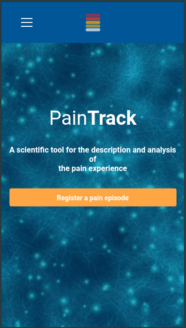
- 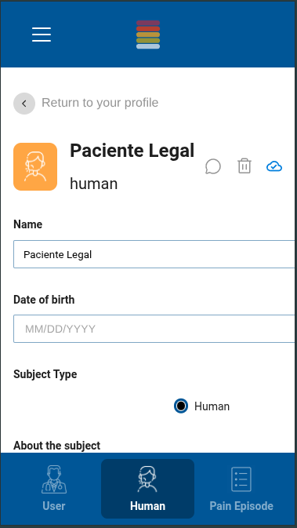
- 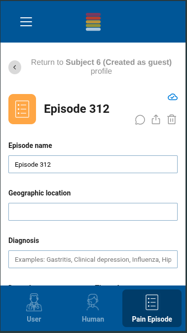

## Track Creation Flow

Tracks are created inside an episode.

When a new track is added, the system creates:

1. the track
2. 3 empty segments inside it

This behavior applies to both logged-in users and guests.

Related screenshots:

- 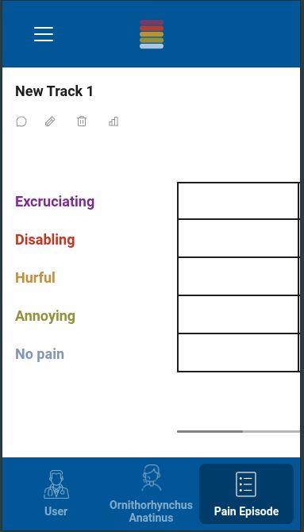

## Segment Creation Flow

Segments are created inside a track.

When a new segment is added, the system creates one empty segment that the user can fill in later.

This is simpler than creating an episode or a track because it does not create additional child items underneath it.

Related screenshots:

- 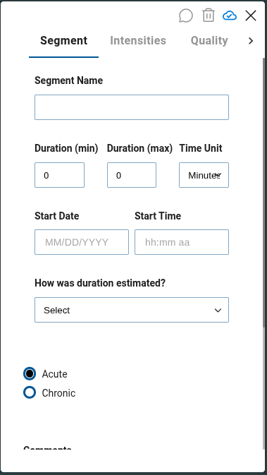
- 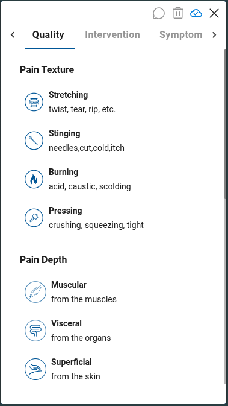
- 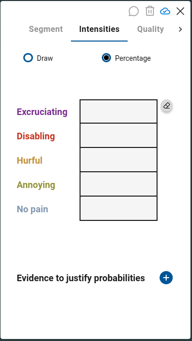
- 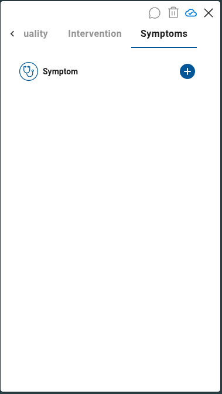
- 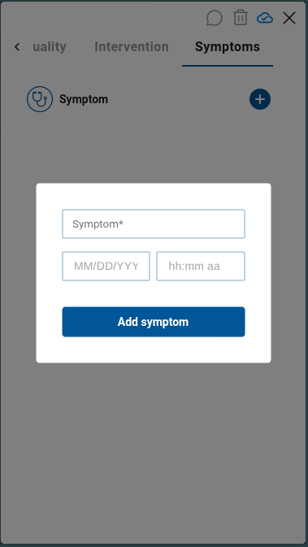
- 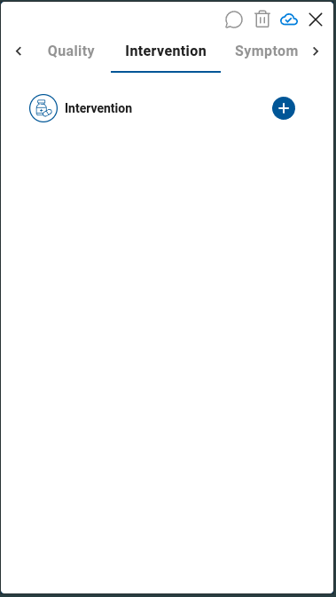
- 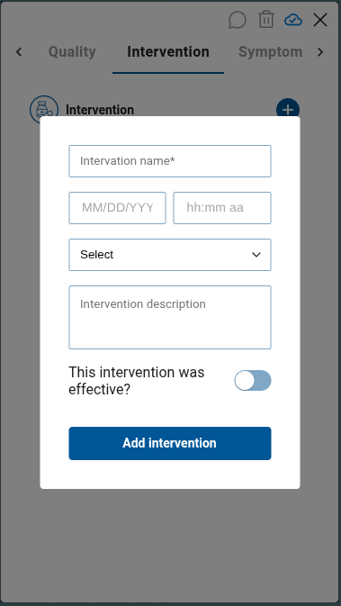

## Guest Flow

The guest journey is:

1. the guest starts a new episode
2. the system creates the episode with an initial track and 3 initial segments
3. the guest edits the episode
4. the guest adds more tracks if needed
5. the guest adds more segments if needed
6. later, if the guest logs in, that work can be attached to the user account

The important point is that guest work is real saved work, not a fake preview.

## Logged-in User Flow

The logged-in journey is:

1. the user logs in
2. the user creates a new episode
3. the system prepares the first track and first 3 segments automatically
4. the user edits the episode
5. the user adds more tracks if needed
6. the user adds more segments if needed

If the user does not choose where the episode should live, the system creates that parent place automatically.

## How Data Is Stored During These Flows

The most important storage behavior described in this repository is:

- guest work is saved immediately
- logged-in work is saved immediately
- creating an episode also creates its first structure automatically
- creating a track also creates its first structure automatically

The system is designed to avoid blank starts. As soon as an episode or track exists, the user already has something they can work on.

## What Happens When A Guest Logs In Later

If a guest has already started an episode and later logs in, the system can move that existing guest work under the logged-in user.

That means:

- the episode is kept
- the tracks are kept
- the segments are kept
- the work is reattached to the user account

The system does not need to rebuild the content from scratch.

## Discussion Flow

The current system includes a discussion feature.

Based on the documented data model, discussions can exist in contexts related to:

- patients
- episodes
- tracks
- segments

Current documented workflow:

1. the user opens the discussion area from the relevant context in the app
2. if no discussion exists, the interface shows an empty state and offers a way to start one
3. the user creates a discussion with a title and body
4. existing discussions appear in a list
5. a discussion can be opened to see its content and comment thread
6. other users can participate by adding comments

Current limitation:

- the feature supports comments, but not a more structured proposal-and-review workflow

Related screenshots:

- 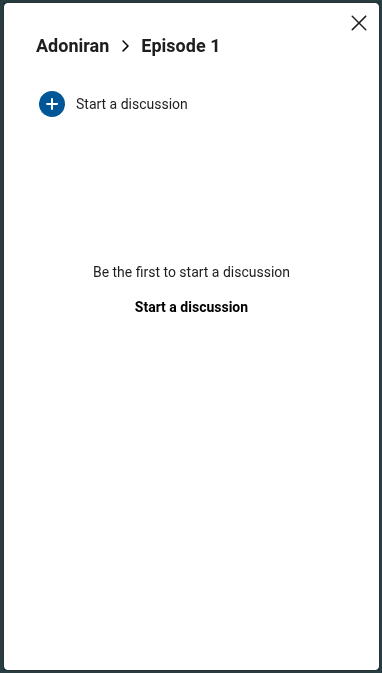
- 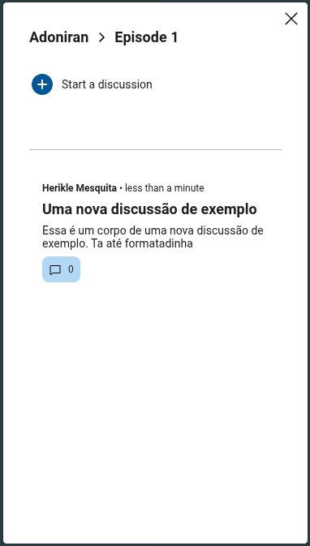
- 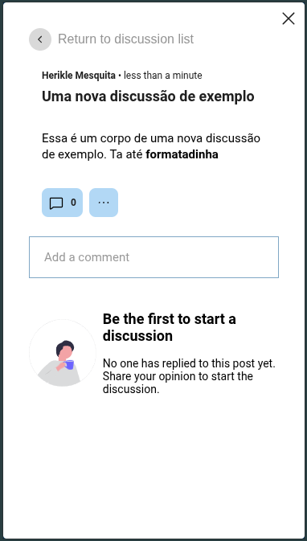

## Known Flow Problems Mentioned In This Repository

- some screens have responsiveness issues on smaller viewports
- guest users have a known bug after episode creation where some track and segment fields cannot be filled as expected

## Practical Summary

- logging in can claim earlier guest work
- creating an episode automatically gives the user a starting structure
- creating a track automatically gives the user a starting structure
- creating a segment adds one more editable part
- guests and logged-in users follow very similar creation flows
- the main difference is whether the work is already attached to an account or still temporary in guest mode